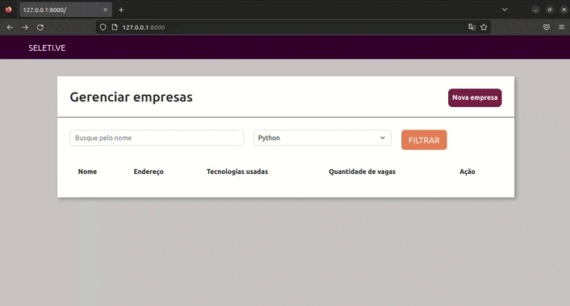

<h1 align="center"> Pay Lab - Vagas de Emprego </h1>

<p align="center">
Site de vagas de emprego desenvolvimento em Django</p>

<p align="center">
  <a href="#rocket-tecnologias">Tecnologias</a>&nbsp;&nbsp;&nbsp;|&nbsp;&nbsp;&nbsp;
  <a href="#computer-projeto">Projeto</a>&nbsp;&nbsp;&nbsp;|&nbsp;&nbsp;&nbsp;
  <a href="#art-layout">Layout</a>&nbsp;&nbsp;&nbsp;|&nbsp;&nbsp;&nbsp;
  <a href="#memo-instalação">Instalação</a>&nbsp;&nbsp;&nbsp;|&nbsp;&nbsp;&nbsp;
  <a href="#unlock-licença">Licença</a>
</p>

<p align="center">
  
</p>

<br>

## :rocket: Tecnologias

Esse projeto foi desenvolvido com as seguintes tecnologias:

- HTML e CSS
- [Django](https://www.djangoproject.com/)

## :computer: Projeto

Projeto usando a framwork Django para criação criação de um site de apresentação de vagas de emprego contendo cadastro de empresas e de vagas, com possibilidade de progresso do processo e envio de emails.

## :art: Layout

Você pode visualizar o layout do projeto através [DESSE LINK](https://www.figma.com/file/fHWDOHbh4u8oO982raWkfw/PYLAB-2022-(Copy)?node-id=0%3A1&t=hpe7MW4HElExgfxX-0). É necessário ter conta no [Figma](https://figma.com) para acessá-lo.

## :memo: Instalação

a partir do diretório `./` execute o seguinte comando para ativar o ambiente virtual:

`source venv/bin/activate`

OBS.: Comando varia conforme sistema operacional

Após inicie o servico com o comando `runserver` do django de acordo com a versão python instalado na máquina:

`version: 2.7`

```
python2 manage.py runserver

# ou

python manage.py runserver
```

`version: 3`

```
python3 manage.py runserver
```
Caso crie novos apps ou modulos efeturar os comandos para gravar-lo no banco de dados:

**Segundo:**
```
python3 manage.py makemigrations
```
Django cria o banco de dados e as migrations, mas não as executa

**Segundo:**
```
python3 manage.py makemigrations
```
Aplica as alterações ao banco

## :unlock: Licença

Esse projeto está sob a licença MIT.

---

Projeto construido durante a Imersão [PayLab](https://pythonando.com.br/pylab/inscricao/pl) 